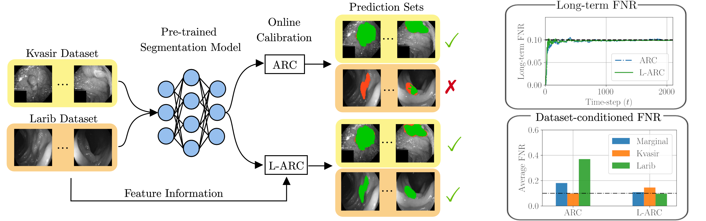

# Localized Adaptive Risk Control 

Code repository of "Localized Adpative Risk Control" by Matteo Zecchin and Osvaldo Simeone.

*Calibration of a tumor segmentation model via ARC and the proposed localized ARC, L-ARC. Calibration data comprises images from multiple sources, namely, the Kvasir data set and the ETIS-LaribPolypDB data set. Both ARC and L-ARC achieve worst-case deterministic long-term risk control in terms of false negative rate (FNR). However, ARC does so by prioritizing Kvasir samples at the detriment of the Larib data source, for which the model has poor FNR performance. In contrast, L-ARC can yield uniformly satisfactory performance for both data subpopulations.*
## The algorithm

Localized Adpative Risk Control (L-ARC) is an online calibration, in which at every time set $t$ the algorithm returns the set predictions  
$$
		C_t=C(X_t,g_t):=\left\{y\in\mathcal{Y}:s(X_t,y)\leq g_t(X_t)\right\},
$$
where $X_t$ is an input covariate, $g_t(\cdot)$ is function within an RKHS $\mathcal{G}$ associated to a kernel $k(\cdot,\cdot)$ and $s(X_t,y)$ is a non-conformity scoring function.

Given a loss function $\mathcal{L}(C,Y)< \infty$, L-ARC uses an online learning scheme to optimize the threshold function $g_t(\cdot)$ based on the observed covariate sequence $\{X_t\}_{t\geq 1}$ and feedback $\{L_t=\mathcal{L}(C_t,Y_t)\}_{t\geq 1}$. In particular, for a target reliability $\alpha$, L-ARC threshold at time $t$ is given by $g_t(\cdot)=f_t(\cdot)+c_t$ where

$$ c_{t+1}=c_{t}-\eta_t(\alpha -L_t) \\
f_{t+1}(\cdot)=(1-\lambda\eta_t)f_t(\cdot)-\eta_t(\alpha -L_t)k(X_t,\cdot)
$$

## Reproducing the experiments

We provide 4 different experiments `{electricity_forecast, tumor_segmentation, beam_selection, fruit_image_classification}`, one in each folder. 
- For the `electricity_forecast` we use the [Elec2Data](https://frouros.readthedocs.io/en/latest/examples/concept_drift/DDM_simple.html). To reproduce the experiment simply run the `main.py` script to run ARC and L-ARC with different localization parameters. The results will be save in the folder `Logs`. After that, by running `plot_figures.py`, the images in the paper will be generated inside the folder `Images`.
- For run the `tumor_segmentation` experiment we use the existing [PraNet](https://github.com/DengPingFan/PraNet) model and data. The pre-processed data, corresponding to the groudthruth masks, model's output and extracted feature can be downloaded from [link](https://www.dropbox.com/scl/fi/1855cjf7cbqd03rb0ku5e/cache.zip?rlkey=k2ity9ly25aujzeg842qmq5xg&st=e28rfl30&dl=0). Place the `.npy`  files in the `cache` directory. To produce the results of the paper, first run the `main.py` script to run ARC and L-ARC with different localization parameters and 10 different seeds. To plot the final average performance use the script `plot_figures.py`.
- For the `beam selection` experiment we include the ray-tracing files, even if they are not necessary to reproduce the experiments. These files can be modified to define different propagation scenes in [Sionna](https://developer.nvidia.com/sionna). We also include the ray-tracing data in the file `data` and the NN SNR predictor `NN_beam_predictor`. To reproduce the experiments, first run the `main.py` script. This will run ARC and L-ARC for 30 different seeds. To test the compute the average SNR over the deployment area coverage use the `test.py` script. The final figures can then be obtained using the script `plot_figures.py` for the average set size and long-term coverage, `plot_SNR_maps.py` for the SNR maps and `plot_SNR_thresholds.py` for the thresholds in the appendix.
- For the `fruit_image_classification` we use the  [fruit-360](https://github.com/antonnifo/fruits-360) data and a pretrained [ResNet18](https://arxiv.org/abs/1512.03385) model. We include the pre-processed data in the folder `data`. To run the experiment, run the `main.py` script that will perform calibration using ARC and L-ARC with different localization parameters. The final results can be plotted using the `plot_figures.py` script. Even if not necessary to reproduce the experiments, in the folder `ResNet_TL` we include a script to perform transfer learning the ResNet18 model using the [fruit-360](https://github.com/antonnifo/fruits-360) data.

## Dependencies
To run the code, the following packages are necessary:
- `frouros` to load the dataset in the `electricity_forecast` experiment. 
- `sklearn` to perform PCA in the `tumor_segmentation` experiment.
- `torch` to perform inference using machine learning models.
- `sionna` to generate the ray-tracing data in the `beam selection` experiment.
- `matplotlib` to plot the figures.
- `numpy` for array numerical operations.
- `pickle` to store and load results.

